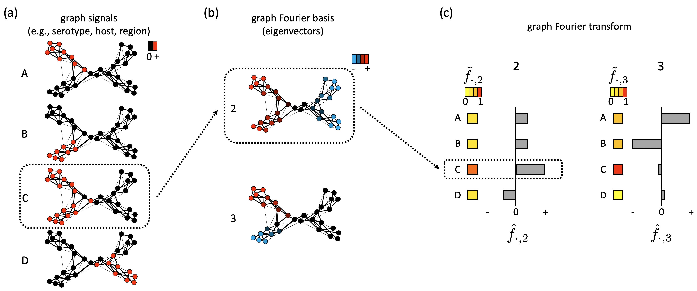
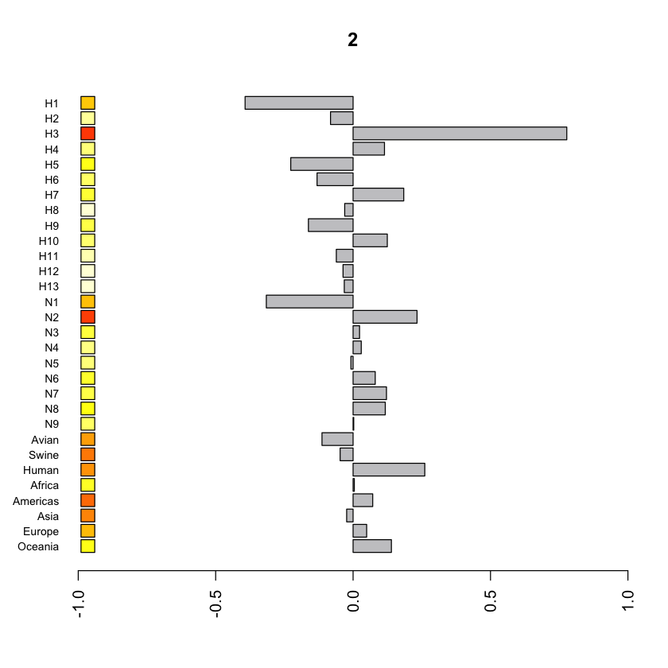

# NeTaGFT
NeTaGFT: a network-based method for trait analysis



## Reference

## Requirements
NeTaGFT is written with R and uses RSpectra library for eigenvalues and vectors calculation.
The ape, phytools, phangorn, phylosignal, phylobase, phylolm, and RPAND library are used for simulation analysis.

## Functions
NeTaGFT includes following functions

- sym_normalized_graph_laplacian(A)
	- Return symmetrically normalized graph Laplacian matrix from the adjacency matrix of A.
- graph_laplacian_regularizer(x, U, eigenvalues)
	- Return aGLR value of trait signal x using eigenvector matrix U and eigenvalues.
- graph_fourier_transform(L,X,m)
	- Return the top-m eigenvectors and eigenvalues of L, graph Fourier coefficients hF and tF (haf_f and tilde_f) for trait data matrix X.
- barplot_gfdomain(hF,tF,i)
	- Plot barplot for GF coefficients for the i-th eigenvector.
- plot_aGLR(X,U,shuffle_num)
	- Plot aGLR values of trait data matrix X. shuffle_num is the number of negative control data generated from shuffling X.
- plot_hF_with_shuffledata(hF, X, i)
	- Plot hF values for i-th eigenvector, including hF values of shuffled data and the other hF values.
- plot_tF_with_shuffledata(tF, X, i)
	- Plot tF values for i-th eigenvector, including tF values of shuffled data and the other tF values.

Details are described in the manual below.

## Dataset
We have four datasets, and each dataset have the ajdacency matrix of k-NNG (A.txt) and binary trait data matrix (X.txt).

- dataset_HA
	- The dataset based on the HA sequences of influenza type A virus.
- dataset_NA
	- The dataset based on the NA sequences of influenza type A virus.
- dataset_PB2
	- The dataset based on the PB2 sequences of influenza type A virus.
- dataset_virome
	- The dataset based on the virome genome gene-sharing data.
- dataset_simulation
	- The example dataset used for simulation analysis.

## Example Jupyter Notebook
The analysis_*.ipynb are the jupyter notebook for each dataset analysis.
The analysis_sim1,2,3,4.ipynb are the notebook for simulation dataset of discrete trait, continuous trait, trait with convergent evolution, and trait with horizontal gene transfer, respectively.

## Manual

***
#### sym_normalized_graph_laplacian
***

#### Description
This function returns symmetrically normalized graph Laplacian matrix from the adjacency matrix of A.
#### Usage
```
sym_normalized_graph_laplacian(A)
```
#### Arguments
- A
	- It is the NxN adjacency matrix that represents the similarity network between samples, where N is the number of samples. In this study, this corresponds to the adjacency matrix of k-NNG.
#### Value
The symmetrically normalized graph Laplacian matrix of A.


***
#### graph_laplacian_regularizer
***

#### Description
This function returns aGLR value of a trait signal x using eigenvector matrix U and eigenvalues.
#### Usage
```
graph_laplacian_regularizer(x, U, eigenvalues)
```
#### Arguments
- x
	- It is a vector of trait signal.
- U and eigenvalues
	- They are an eigenvector matrix U and eigenvalues calculated with graph_fourier_transform function.
#### Value
The aGLR values of the trait signal x.


***
#### graph_fourier_transform
***

#### Description
This function returns the top-m eigenvectors and eigenvalues of L, graph Fourier coefficients hF and tF (hat_f and tilde_f) for trait data matrix X.
#### Usage
```
graph_fourier_transform(L,X,m)
```
#### Arguments
- L
	- The graph laplacian calculated with sym_normalized_graph_laplacian function.
- X
	- The NxM trait data matrix, where N and M are the number of samples and traits, respectively.
- m
	- A value specifying that eigenvalues and eigenvectors up to the m-th rank are to be computed.
#### Value
The list of U, eigenvalues, hF, and tF, where U is the Nxm eigenvector matrix, eigenvalues is the vector of eigenvalue of length m, hF and tF are the mxM matrix of hat_f and tilde_f values.


***
#### barplot_gfdomain
***

#### Description
Plot barplot for GF coefficients for the i-th eigenvector.
#### Usage
```
barplot_gfdomain(hF,tF,i)
```
#### Arguments
- hF and tF
	- The hF and tF calculated with graph_fourier_transform function.
- i
	- It is the parameter to specify the index of the eigenvector. The hF and tF values for eigenvector u_i are visualized.

#### Output image example



***
#### plot_aGLR
***

#### Description
Plot aGLR values of trait data matrix X. The red horizontal line indicates the average value of aGLR for shuffled data.
#### Usage
```
plot_aGLR(X,U,shuffle_num)
```
#### Arguments
- X
	- The trait data matrix.
- U
	- The eigenvector matrix.
- shuffle_num
	- It is the number of negative control data generated from shuffling X.

#### Output image example


***
#### plot_hF_with_shuffledata
***

#### Description
Plot hF values for i-th eigenvector, including hF values of shuffled data and the other hF values. For each trait, the red line represents the hat_f value calculated from the actual trait signal, the middle boxplot represents the value calculated by shuffling the trait signal 100 times, and the right boxplot represents the distribution of actual hat_f values for the other eigenvectors excluding the i-th eigenvector.
#### Usage
```
plot_hF_with_shuffledata(hF, X, i)
```
#### Arguments
- hF
	- The hF matrix calculated by graph_fourier_transform function.
- X
	- The trait data matrix.
- i
	- It is the parameter to specify the index of the eigenvector. The hF and tF values for eigenvector u_i are visualized.
### Example
You can plot part of traits as follows,

```
target_trait_idx <- c(1:3,14:16)
plot_hF_with_shuffleddata(hF[,target_trait_idx], X[,target_trait_idx], 7)
```

#### Output image example


***
#### plot_tF_with_shuffledata
***

#### Description
Plot tF values for i-th eigenvector, including tF values of shuffled data and the other tF values. For each trait, the red line represents the tilde_f value calculated from the actual trait signal, the middle boxplot represents the value calculated by shuffling the trait signal 100 times, and the right boxplot represents the distribution of actual tilde_f values for the other eigenvectors excluding the i-th eigenvector.
#### Usage
```
plot_tF_with_shuffledata(tF, X, i)
```
#### Arguments
- tF
	- The tF matrix calculated by graph_fourier_transform function.
- X
	- The trait data matrix.
- i
	- It is the parameter to specify the index of the eigenvector. The tF and tF values for eigenvector u_i are visualized.
### Example
You can plot part of traits as follows,

```
target_trait_idx <- c(1:3,14:16)
plot_tF_with_shuffleddata(tF[,target_trait_idx], X[,target_trait_idx], 7)
```

#### Output image example

